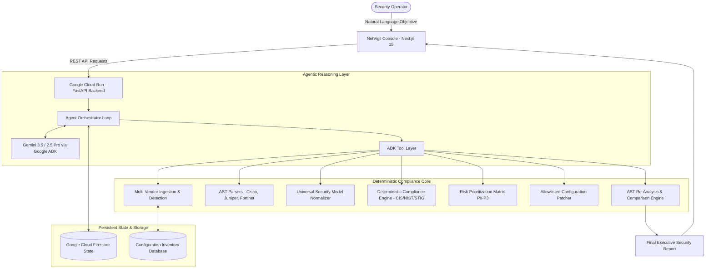

# NetVigil Architecture & Systems Design

## 1. System Overview

NetVigil is an autonomous, multi-vendor network security compliance and remediation engineer. The system pairs Google's advanced Gemini LLM and Google Agent Development Kit (ADK) with an authoritative deterministic compliance engine and Google Cloud infrastructure.



---

## 2. Layer-by-Layer Architecture

### A. Presentation & Console Layer (`apps/web`)
* **Framework**: Next.js 15 (React 19, TypeScript).
* **Console Workspace** (`/agent`):
  * Command Center with natural language objective input and golden presets.
  * Real-time 12-step Activity Timeline with tool telemetry drill-down.
  * Human-in-the-Loop Approval Card with color-coded visual diffs.
  * Deterministic Verification Proof with $FAIL \rightarrow PASS$ transitions.
  * State recovery via `localStorage` and URL parameters.

### B. Serverless Hosting & API Layer (`apps/api`)
* **Framework**: FastAPI / Python 3.13 / AsyncIO.
* **Hosting**: Google Cloud Run (Containerized via `Dockerfile.api`).
* **Endpoints**:
  * `POST /api/v1/agent/run` — Launch workflow and pause at approval gate.
  * `GET /api/v1/agent/sessions/{session_id}` — Real-time execution status polling.
  * `POST /api/v1/agent/sessions/{session_id}/approve` — Administrator approval/rejection.
  * `GET /api/v1/agent/sessions/{session_id}/report` — Executive verified audit report.
  * `GET /health` — Diagnostic health probe for Cloud Run.

### C. Agent Reasoning & Tool Layer (`apps/api/app/services/agent`)
* **LLM Engine**: Google Gemini 3.5 / 2.5 Pro.
* **Framework**: Google Agent Development Kit (ADK) function calling schemas.
* **Standardized ADK Tools**:
  * `discover_configurations`: Scans fleet inventory for active configuration files.
  * `detect_vendor`: Classifies syntax dialects (Cisco IOS, Juniper JunOS, Fortinet FortiOS).
  * `analyze_configuration_tool`: Parses CLI into Abstract Syntax Trees and extracts USM facts.
  * `run_compliance_audit_tool`: Evaluates rules against baseline benchmarks (CIS, NIST, STIG).
  * `get_findings_tool`: Groups violations into composite risk scores ($0-100$, $P0-P3$).
  * `generate_remediation_plan_tool`: Generates allowlisted remediation diffs with constraint masking.
  * `apply_approved_remediations`: Executes validated patches against configuration AST blocks.
  * `verify_and_compare`: Re-parses AST and deterministically proves finding resolution.

### D. Deterministic Security Core (`apps/api/app/services`)
* **Parsers**: Native regex and tokenizer AST parsers for hierarchical, flat, and set-based CLI formats.
* **Universal Security Model (USM)**: Standardizes multi-vendor syntax into 8 canonical security domains:
  1. Authentication & Access Control (AAA, SSH, Console, VTY)
  2. Protocol Management (Telnet, HTTP, SNMP)
  3. Logging & Auditing (Syslog, NTP, Buffer)
  4. Network Services (DNS, DHCP, CDP, LLDP)
  5. Cryptography & Key Management (RSA, Ciphers, Passwords)
  6. Routing Security (BGP, OSPF, ACLs)
  7. Management Plane Protection (Control plane filtering)
  8. Interface & Port Hardening (Switchport, shutdown)
* **Rule Evaluator**: Boolean AST logic evaluator providing grounded line citations.
* **Patcher**: Allowlisted line-replacement engine that blocks arbitrary command execution.

### E. Persistent State Management (`AgentMemoryManager`)
* **Firestore Schema**: Stored under `netvigil_agent_sessions/{session_id}`:
  * `session_id`, `objective`, `created_at`, `status`, `constraints`, `timeline`, `proposals`, `active_approval`, `verification_results`, `final_report`.
* **Resumability**: Decoupled from HTTP connection; enables multi-operator handoffs and browser reload resilience.

---

## 3. Security Boundary & Guardrails

```text
┌────────────────────────────────────────────────────────┐
│                   UNTRUSTED USER INPUT                 │
└───────────────────────────┬────────────────────────────┘
                            │
                            ▼
┌────────────────────────────────────────────────────────┐
│           GEMINI INTENT & CONSTRAINT REASONING         │
│  (Extracts boundaries, e.g. subsystem="ssh", DO_NOT_MODIFY) │
└───────────────────────────┬────────────────────────────┘
                            │
                            ▼
┌────────────────────────────────────────────────────────┐
│          DETERMINISTIC COMPLIANCE & SAFETY GATE        │
│  • Only Allowlisted Templates Permitted               │
│  • Negative Constraints Enforced Server-Side          │
│  • Operator Approval Required Before Any Patch Applied │
└───────────────────────────┬────────────────────────────┘
                            │
                            ▼
┌────────────────────────────────────────────────────────┐
│            AUTOMATIC AST RE-ANALYSIS & PROOF           │
│  • Proves FAIL → PASS Transition                       │
│  • Validates Protected Subsystems are 100% Unchanged  │
└────────────────────────────────────────────────────────┘
```
