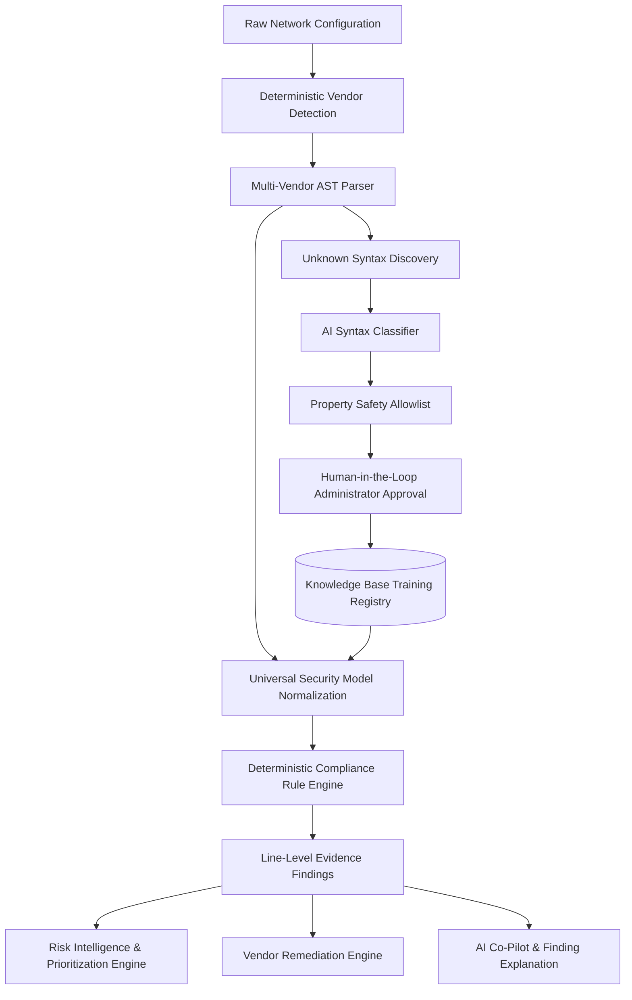

# NetVigil Technical Architecture Document

**Project:** NetVigil — AI-Driven Multi-Vendor Network Security Compliance Auditor  
**Problem Statement:** SIH26155 | **Theme:** Blockchain & Cybersecurity  
**Organization:** National Technical Research Organisation (NTRO)

---

## 1. System Overview & Architecture

NetVigil is an enterprise-grade cybersecurity platform that evaluates multi-vendor network device configurations against international compliance frameworks (**CIS Benchmarks**, **NIST SP 800-53**, **DISA STIG**, and **ISO/IEC 27001**) and synthesizes prioritized, actionable risk intelligence.

---

## 2. Component Specifications

### 2.1 Vendor Detection & AST Parsing
- **Cisco IOS / IOS-XE**: Block-level and statement parsing for AAA, interfaces, VTY lines, crypto maps, SNMP, logging, and NTP.
- **Juniper JunOS**: Dual syntax support for both hierarchical brace syntax (`system { services { ssh; } }`) and flat `set` syntax (`set system services ssh protocol-version v2`).
- **Fortinet FortiOS**: Block-based `config <block> ... edit <item> ... set <key> <val> ... end` grammar parsing.

### 2.2 Universal Security Normalization
Standardizes raw syntax into a canonical 8-domain model (`NormalizedSecurityProfile`):
- `remote_access` (SSH version, Telnet status, HTTP/HTTPS web management, session timeout, VTY ACLs)
- `authentication` (AAA new-model, password encryption, enable secret, login lockouts)
- `authorization` (RBAC privilege levels, command authorization)
- `logging` (system logging, remote Syslog host forwarding, timestamps)
- `time_sync` (authoritative NTP servers, cryptographic authentication)
- `access_control` (Control Plane Policing, perimeter default-drop ACLs)
- `network_security` (STP BPDU Guard, DHCP Snooping, Dynamic ARP Inspection, Port Security)
- `services` (SNMP community security, finger daemon, Proxy ARP)

### 2.3 Deterministic Compliance Engine
- Evaluates rules from `unified_catalog.json` with 100% reproducible results.
- Generates `PASS`, `FAIL`, `PARTIAL`, `UNKNOWN`, `NOT_APPLICABLE` with verbatim source line citations and observed vs expected values.

### 2.4 Risk Intelligence Engine
- Computes the **NetVigil Risk Score (0–100)**:
  $$\text{Raw Score} = (\text{Base Severity} \times 0.70) + ((\text{Exposure Mod} + \text{Impact Mod}) \times 1.5) + \text{Bonus}$$
- Maps to Priority Bands: **P0 (Immediate)**, **P1 (High)**, **P2 (Medium)**, **P3 (Low)**.
- Constructs deterministic risk relationship graphs (`DEVICE` $\rightarrow$ `EXPOSURE` $\rightarrow$ `RISK` $\rightarrow$ `FINDING`).

### 2.5 Vendor-Specific Remediation Center
- Verified static templates for Cisco, Juniper, and Fortinet.
- Computes configuration diffs (`REMOVE`, `ADD`, `UNCHANGED`).
- Enforces strict **Zero Automated Execution Policy** with human review sign-off.

### 2.6 Adaptive Training & Knowledge System
- Identifies unparsed vendor syntax.
- AI suggests candidate meaning with confidence scoring.
- Enforces strict `NORMALIZED_PROPERTY_ALLOWLIST` security guard.
- Security Administrator approves/edits mapping with audit trail logging in `TrainingAuditTrail`.
- Dynamically updates active knowledge base without backend restarts.

---

## 3. Technology Stack & Security Invariants

| Layer | Technology |
| :--- | :--- |
| **Backend Framework** | FastAPI (Python 3.13) with AsyncIO |
| **ORM & Database** | SQLAlchemy 2.0 (Async), Alembic Migrations, PostgreSQL / SQLite |
| **Frontend Framework** | Next.js 15 (App Router), React 19, TypeScript |
| **Data Fetching** | TanStack Query v5 |
| **Styling & UI** | TailwindCSS, Lucide Icons, Glassmorphism SOC Dark Design |
| **Testing** | Pytest (70 tests), Pytest-Asyncio, HTTPX |
| **Deployment** | Docker, Docker Compose, Multi-stage builds |

### Security Invariants:
1. **Zero Automated Execution**: No subprocess or SSH push to live devices.
2. **Immutable Finding Integrity**: AI can never override deterministic compliance verdicts.
3. **Allowlisted Knowledge Safety**: No arbitrary property paths or code injection through learned mappings.
4. **Data Minimization**: Secret redaction across logs, reports, and AI context payloads.
